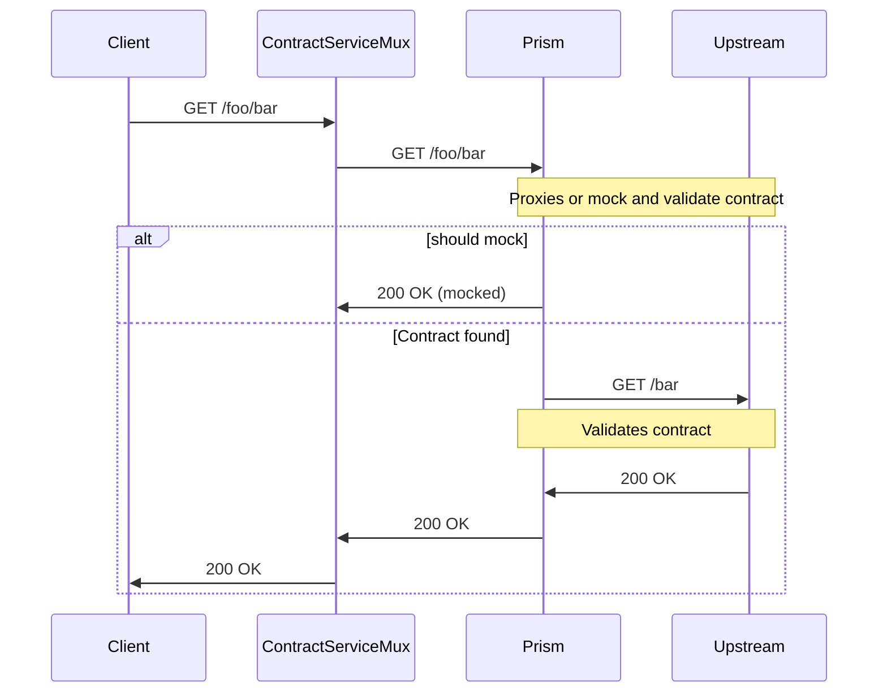

# Contract Mux Service

Contract testing service multiplexer. A centralized contract testing service for
validating requests and responses against an openapi specification.

## Why?

This service solves 3 main problems:

### Teams integration and communication (eg. frontend and backend)

This solves the issue where a client (eg. frontend) has to implement a feature while lacking the
endpoint from an api implementation. Which is a common issue when working with microservices and with
teams where the frontend and backend are developed separately.

The consequences of that approach is that once the backend is implemented the frontend
might not be compatible with the new implementation, that comes the contract testing!

Since the contract is validated against the real service, the frontend can be sure that
the implementation is compatible with the contract described in the openapi specification.

### Reliable UI/e2e testing

Many times the UI tests are flaky because one or more services aren't stable, with this service
the UI tests can be more reliable since a mocked response can be returned from the prims server
based on the openapi specification. For e2e tests, this services can proxy requests
to the real service and check the contract.

### Shared enviroment

Spining up a mock service in a shared enviroment is usually not a simple task. This service
reduces the complexity to a single configuration file.

## Benefits

- Enforces usage of openapi specification to all services.
- Reliable UI/e2e tests.
- Contract testing without special setup, the consumer must simply implement
a integration test agains the contract service URL instead of the real service.

## Architecture

This service contains a reverse proxy that forwards requests to a prims server.
The prims server will then forward the requests to the upstream (real api)
and validate the request and response against the contract configured in `proxy.json`
so when you call `http:localhost:4400/foo/bar` it will forward the request to
`http://localhost:3000/bar` given that it's configured like:

```json
{
    "providers": [
        {
            "name": "foo",
            "hostname": "localhost",
            "port": 3000,
            "openapiFile": "./providers/foo/openapi/api.yaml"
        },
        {
            "name": "foo",
            "hostname": "localhost",
            "port": 3000,
            "git": {
                "repo": "cristianoliveira/myprivaterepo",
                "path": "api2.yaml",
                "tag": "main"
            }
        },
    ],
}
```

Here is flow sequence diagram:



## Running

### Requirement
 - Node 20
 - Docker

### Running

Locally
```bash
npm install
npm run start
```

Docker
```bash
docker compose up
```

### Testing

```bash
npm run test
```
