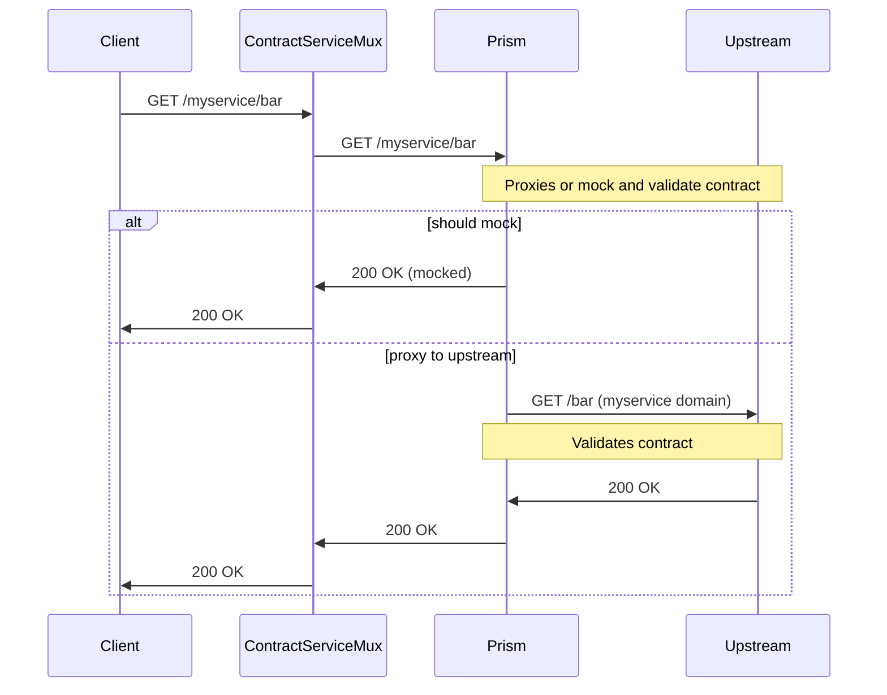

# Contract Mux Service

Contract testing service multiplexer. A centralized contract testing service for
validating requests and responses against an openapi specification. (See [prism](https://github.com/stoplightio/prism))

## Why?

This service solves 3 main problems:

### Teams integration and communication (eg. frontend and backend)

This solves the issue where a client (eg. frontend) has to implement a feature while lacking the
endpoint from an api implementation. Which is a common issue when working with microservices and with
teams where the frontend and backend are developed separately.

The consequences of that approach is that once the backend is implemented the frontend
might not be compatible with the new implementation, that comes the contract testing!

Since the contract is validated against the real service, the frontend can be sure that
the implementation is compatible with the contract described in the openapi specification.

### Reliable UI/e2e testing

Many times the UI tests are flaky because one or more services aren't stable, with this service
the UI tests can be more reliable since they can be written against a mock response from prism service
based on the **openapi specification examples** (which contribute with a more rich API documentation!). 
For e2e tests, this services can proxy requests to the real service and check the contract.

### Shared environment

Spining up a mock service in a shared environment is usually not a simple task. This service
reduces the complexity to a single configuration file.

## Benefits

- Enforces usage of openapi specification to all services.
- Reliable UI/e2e tests.
- Contract testing without special setup, the consumer must simply implement
a integration test agains the contract service URL instead of the real service.

## Architecture

This service contains a reverse proxy that forwards requests to a prism server.
The prism server will then forward the requests to the upstream (real api)
and validate the request and response against the contract configured in `proxy.json`
so when you call `http:foo.localhost:4400/bar` it will forward the request to
`http://localhost:3000/bar` given that it's configured like:

```json
{
    "providers": [
        {
            "name": "foo",
            "port": 3000,
            "file": "./providers/foo/openapi/api.yaml"
        },
        {
            "name": "anotheruniquename",
            "port": 3001,
            "git": {
                "repo": "cristianoliveira/myprivaterepo",
                "path": "api2.yaml",
                "tag": "main"
            }
        },
    ],
}
```
Once running that will create a api gateway with the following endpoints (see fixtures/*.yml):

```bash

Provider: foo
  http://foo.localhost:4400/pets/{id}/status -> {foo-provider}/v1/pets/{id}/status
  http://foo.localhost:4400/pets/sessions/{id} -> {foo-provider}/v1/pets/sessions/{id}

provider: anotheruniquename
  http://anotheruniquename.localhost:4400/cats/{id} -> {anotheruniquename-provider}/pets/foo/status
```
Those endpoints will respond either with auto-generated responses or mocks based on the specs `examples` section. The service can
also, proxy the requests upstream and validate the specification with a real response!

## Flow

Here is flow sequence diagram:



## Running

### Requirement
 - Node 20
 - Docker

### Running

Locally
```bash
npm install
npm run start
```

Docker
```bash
docker compose up
```

**Note**: When running localhost you must add the services subdomains into `/etc/hosts` file like:

```bash
127.0.0.1        foo.localhost
127.0.0.1        anotheruniquename.localhost
```

### Testing

```bash
npm run test
```

### Load testing

```bash
echo "GET http://foo.mydomain.org:4400/pets/1/status" | vegeta attack -duration=1m | tee vegeta-results.bin | vegeta report
```

Simple test result
```
Requests      [total, rate, throughput]         3000, 50.02, 49.87
Duration      [total, attack, wait]             1m0s, 59.98s, 182.012ms
Latencies     [min, mean, 50, 90, 95, 99, max]  178.291ms, 229.137ms, 188.06ms, 309.372ms, 356.702ms, 683.663ms, 1.054s
Bytes In      [total, mean]                     1023000, 341.00
Bytes Out     [total, mean]                     0, 0.00
Success       [ratio]                           100.00%
Status Codes  [code:count]                      200:3000
Error Set:
```
